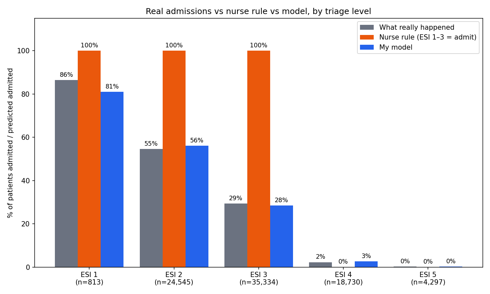

# Predictive ER Admission Engine

Machine learning model that predicts, **at the moment of triage**, whether an emergency department patient will need an inpatient bed, giving hospitals a head start on bed logistics hours before an admission order is written.

> ⚠️ Research and portfolio project. Not a medical device and not intended for clinical use.

## The problem

Canadian emergency departments face chronic bed shortages. Patients who need admission often wait hours on ER stretchers ("boarding") because bed searches only begin after a physician writes the admission order. Boarding blocks ER capacity and drives up wait times for everyone.

## The approach

The moment a triage nurse records vitals and acuity, the model outputs a probability that the patient will be admitted. Bed management teams can use high-risk flags to start sourcing beds early.

Design principles:
- **Triage-time features only.** Nothing recorded after triage (labs, imaging, physician notes), to avoid data leakage.
- **Sensitivity first.** The decision threshold is tuned for ≥90% recall, because missing a patient who needs a bed is costlier than preparing one that goes unused.
- **Beat the current practice.** The benchmark is the nurse's **ESI** triage score, which is what hospitals already use.
- **Explainable.** SHAP values to show which vitals and acuity levels drive each prediction (in progress).

## Data

[Hospital Triage and Patient History Data](https://www.kaggle.com/datasets/maalona/hospital-triage-and-patient-history-data) (Kaggle): ~560,000 adult ED visits from a US health system, from Hong, Haimovich & Taylor (2018), *Predicting hospital admission at emergency department triage using machine learning*, PLOS ONE.

- ~30% of visits result in admission
- Acuity is recorded as **ESI** (Emergency Severity Index), a 5-level scale comparable to Canada's **CTAS**
- Data is **not** included in this repo. See notebook 01 to download it.
- Stratified 70 / 15 / 15 train / validation / test split. Cutoffs are chosen on validation; all reported scores are on the untouched test set.

## Results

| Model | Test AUROC |
|---|---|
| Nurse ESI score (as a risk score) | 0.766 |
| Logistic regression | 0.872 |
| **PyTorch neural network** | **0.878** |
| LightGBM | 0.880 |

For reference, the original study reported an AUROC of about 0.87.

**Model vs the nurse's ESI rule at the same recall.** The usual hospital rule is to treat ESI 1–3 as "likely admit". Matching that rule's recall (97.9%) on the test set:

| | Patients flagged | Recall | False alarms |
|---|---|---|---|
| Nurse rule (ESI ≤ 3) | 60,692 | 0.979 | 36,225 |
| PyTorch model | 57,522 | 0.979 | 33,063 |

At 90% recall the PyTorch model has a precision of 0.533, meaning about 53% of the patients it flags are really admitted.



### Key findings

- The model ranks admitted patients above non-admitted ones about 88% of the time, against 77% for ESI alone.
- At the same 98% recall as the ESI ≤ 3 rule, the model raises about 3,200 fewer false alarms (~9% fewer). The gain at that very high recall is modest.
- ESI is a coarse 5-level scale (ESI ≤ 2 catches ~57% of admits, ESI ≤ 3 catches ~98%, with nothing in between). The model gives a continuous risk score, so a hospital can pick any recall target.
- A small neural network, logistic regression and LightGBM all land within 0.01 AUROC of each other. With triage-only data, the ceiling comes from the information available, not the algorithm.

## Repo structure

```
notebooks/
  01_data_loading.ipynb    Kaggle download, triage feature extraction, cache to Drive
  02_eda.ipynb             Admission rate by acuity, vitals, missingness
  03_baselines.ipynb       ESI-only vs logistic regression vs LightGBM
  04_pytorch_model.ipynb   PyTorch neural network, comparison against the nurse's ESI
app/                       Streamlit demo (planned)
images/                    Figures for this README
```

## How to run

1. Open `notebooks/01_data_loading.ipynb` in Google Colab.
2. Add your Kaggle credentials to Colab Secrets (🔑 in the sidebar).
3. Run notebooks 01 → 04 in order. Data is cached to your Google Drive after notebook 01.

## Roadmap

- [x] Data pipeline
- [x] Exploratory analysis
- [x] Baseline models (ESI, logistic regression, LightGBM)
- [x] PyTorch model compared against the nurse's ESI
- [ ] SHAP explainability
- [ ] Streamlit demo
- [ ] Calibration analysis

## Limitations

- Trained on US data with ESI acuity; Canadian deployment would require validation on CTAS-coded data.
- Single health system, which may not generalize to other hospitals.
- No visit timestamps, so evaluation uses a random rather than time-based split.
- The ESI-based baseline comes from the same dataset's historical admit rates, not from a clinician's explicit admission prediction.

## Author

Chizaram Agbanelo
