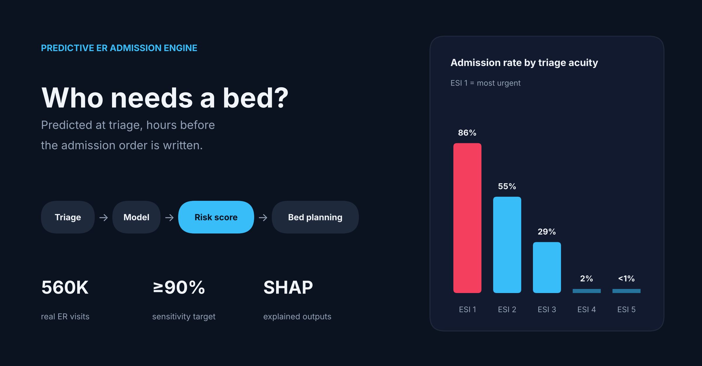

# Predictive ER Admission Engine

Machine learning model that predicts, **at the moment of triage**, whether an emergency department patient will need an inpatient bed, giving hospitals a head start on bed logistics hours before an admission order is written.

> ⚠️ Research and portfolio project. Not a medical device and not intended for clinical use.

## The problem

Canadian emergency departments face chronic bed shortages. Patients who need admission often wait hours on ER stretchers ("boarding") because bed searches only begin after a physician writes the admission order. Boarding blocks ER capacity and drives up wait times for everyone.

## The approach

The moment a triage nurse records vitals, acuity, and chief complaint, the model outputs a probability that the patient will be admitted. Bed management teams can use high-risk flags to start sourcing beds early.

Design principles:
- **Triage-time features only.** Nothing recorded after triage (labs, imaging, physician notes), to avoid data leakage.
- **Sensitivity first.** The decision threshold is tuned for ≥90% recall, because missing a patient who needs a bed is costlier than preparing one that goes unused.
- **Explainable.** SHAP values show which vitals and acuity levels drive each prediction.

## Data

[Hospital Triage and Patient History Data](https://www.kaggle.com/datasets/maalona/hospital-triage-and-patient-history-data) (Kaggle): ~560,000 adult ED visits from a US health system, from Hong, Haimovich & Taylor (2018), *Predicting hospital admission at emergency department triage using machine learning*, PLOS ONE.

- ~30% of visits result in admission
- Acuity is recorded as **ESI** (Emergency Severity Index), a 5-level scale comparable to Canada's **CTAS**
- Data is **not** included in this repo. See notebook 01 to download it.

## Results

| Model | AUROC | PR-AUC | Recall | Precision |
|---|---|---|---|---|
| ESI only (baseline) | – | – | – | – |
| Logistic regression | – | – | – | – |
| LightGBM | – | – | – | – |

_Recall/precision at a threshold chosen on the validation set for ≥90% recall. Results to be filled in._

## Repo structure

```
notebooks/
  01_data_loading.ipynb    Kaggle download, triage feature extraction, cache to Drive
  02_eda.ipynb             Admission rate by acuity, vitals, missingness
  03_baselines.ipynb       ESI-only vs logistic regression vs LightGBM
app/                       Streamlit demo (planned)
images/                    Figures for this README
```

## How to run

1. Open `notebooks/01_data_loading.ipynb` in Google Colab.
2. Add your Kaggle credentials to Colab Secrets (🔑 in the sidebar).
3. Run notebooks 01 → 03 in order. Data is cached to your Google Drive after notebook 01.

## Roadmap

- [x] Data pipeline
- [x] Exploratory analysis
- [ ] Baseline models
- [ ] SHAP explainability
- [ ] Streamlit demo
- [ ] Calibration analysis

## Limitations

- Trained on US data with ESI acuity; Canadian deployment would require validation on CTAS-coded data.
- Single health system, which may not generalize to other hospitals.
- No visit timestamps, so evaluation uses a random rather than time-based split.

## Author

Chizaram Agbanelo
